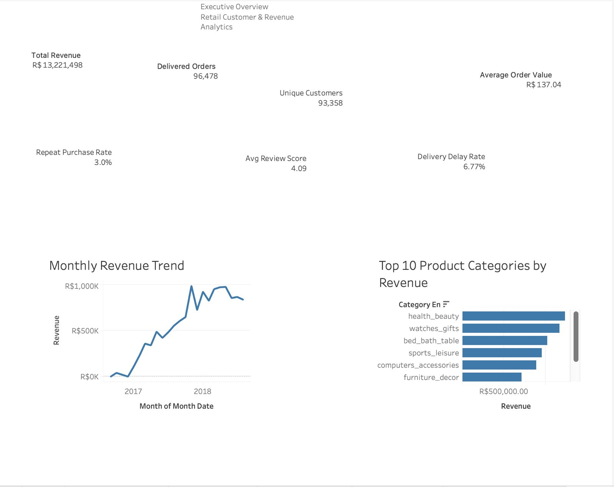

# Enterprise Marketing Analytics Platform

## Project Summary

End-to-end analytics project using Brazilian e-commerce data to clean, model, analyze, report, and visualize customer, revenue, product, delivery, and review performance.

Built on the [Olist Brazilian E-Commerce](https://www.kaggle.com/datasets/olistbr/brazilian-ecommerce) public dataset — a recruiter-facing portfolio demonstrating SQL, Python, DuckDB, Tableau, Excel automation, and business storytelling.

---

## Business Problem

This project analyzes e-commerce performance to help stakeholders understand revenue trends, customer behavior, product category performance, repeat purchasing, delivery delays, and customer satisfaction.

Without integrated analytics, leadership cannot easily answer questions about revenue growth, customer retention, category performance, delivery quality, or satisfaction trends. This platform provides a reproducible pipeline from raw data through KPI reporting and executive dashboards.

---

## Tools Used

- Python
- Pandas
- SQL
- DuckDB
- Tableau Public
- Excel automated reporting
- Jupyter Notebook
- Git / GitHub
- AI-assisted documentation and summary generation

---

## Workflow

```
Raw Data → Python Cleaning → DuckDB Database → SQL KPI Views → EDA Notebook → Automated Excel Report → Tableau Dashboard → Business Recommendations
```

**Pipeline scripts:**

1. `src/data_cleaning.py` — clean Olist CSVs → `data/processed/`
2. `src/load_to_database.py` — load into DuckDB + build KPI views
3. `notebooks/02_exploratory_analysis.ipynb` — EDA and chart exports
4. `src/generate_kpi_report.py` — weekly Excel KPI workbook
5. `src/ai_executive_summary.py` — executive summary markdown
6. Tableau — connect to `data/processed/dashboard_exports/`

---

## Key Metrics

All metrics are from delivered orders in `data/processed/olist_analytics.duckdb` — not fabricated.

| Metric | Value |
|--------|-------|
| Delivered Orders | 96,478 |
| Unique Customers | 93,358 |
| Total Revenue | R$ 13,221,498.11 |
| Total Payment Value | R$ 16,008,872.12 |
| Average Order Value (AOV) | R$ 137.04 |
| Repeat Purchase Rate | 3.0% |
| Average Review Score | 4.09 |
| Delivery Delay Rate | 6.77% |

---

## Tableau Dashboard

**Workbook:** `dashboards/tableau/olist_analytics_dashboard.twbx`  
**Data source:** `data/processed/dashboard_exports/` (13 CSV files from DuckDB KPI views)

### Executive Overview (Page 1 — Completed)



### Dashboard status

| Page | Status | Focus |
|------|--------|-------|
| Executive Overview | **Completed** | KPI scorecard, revenue trend, top categories |
| Customer 360 | Planned | RFM segments, CLV, repeat customers |
| Revenue & Product Performance | Planned | Category ranking, state revenue, Pareto |
| Customer Experience & Delivery | Planned | Review scores, delay rate, delay vs. rating |

Design specifications: `docs/dashboard_design_notes.md`  
Build guide: `docs/powerbi_build_guide.md` (CSV field mappings also apply to Tableau)

### Supporting EDA charts

| Chart | File |
|-------|------|
| Monthly revenue trend | `dashboards/screenshots/revenue_trend.png` |
| Top product categories | `dashboards/screenshots/revenue_by_category.png` |
| Revenue by state | `dashboards/screenshots/revenue_by_state.png` |
| Delivery performance | `dashboards/screenshots/delivery_performance.png` |
| Review score distribution | `dashboards/screenshots/review_summary.png` |
| Repeat purchase rate | `dashboards/screenshots/repeat_purchase_rate.png` |

---

## Project Structure

```
enterprise-marketing-analytics-platform/
├── data/           # raw + processed data (raw & DB excluded from GitHub)
├── src/            # Python scripts for cleaning, loading, reports, summaries
├── scripts/        # Chart export utilities
├── sql/            # KPI views, segmentation, dashboard SQL
├── notebooks/      # EDA and analysis notebooks
├── reports/        # Excel KPI report and executive summaries
├── docs/           # methodology, data dictionary, dashboard guides
└── dashboards/     # Tableau workbook and dashboard screenshots
```

| Folder | Purpose |
|--------|---------|
| `src/` | Python scripts for cleaning, database loading, reports, and summaries |
| `sql/` | SQL scripts for table creation, KPI views, segmentation, and dashboard views |
| `notebooks/` | EDA and analysis notebooks |
| `reports/` | Excel KPI report and executive summaries |
| `docs/` | Methodology, data dictionary, EDA summary, dashboard build guides |
| `dashboards/` | Tableau workbook (`.twbx`) and dashboard screenshots |
| `data/` | Raw and processed data — raw CSVs and DuckDB database excluded from GitHub |

---

## Business Insights

1. Revenue grew strongly across the observed period, with a major peak in late 2017 (November 2017: R$ 987,765).
2. Health & beauty, watches/gifts, and bed/bath/table were among the top revenue categories (~40% of category revenue).
3. Repeat purchase rate is low at 3.0%, showing a retention opportunity (~97% of customers made one purchase).
4. Average review score is strong at 4.09, but delivery delays still affect customer experience (on-time: 4.29 vs delayed: 2.27).
5. Delivery delay rate of 6.77% creates an opportunity for logistics improvement.

Full analysis: `docs/eda_summary.md` | `reports/insights_summary.md`

---

## Business Recommendations

1. Improve retention campaigns for one-time customers.
2. Prioritize high-performing categories in marketing and inventory planning.
3. Monitor delivery delay trends monthly.
4. Use customer segmentation for targeted offers.
5. Build recurring executive reporting using automated Excel and Tableau dashboard outputs.

---

## How to Run Locally

```bash
# 1. Clone and set up environment
git clone <your-repo-url>
cd enterprise-marketing-analytics-platform
python3 -m venv .venv
source .venv/bin/activate
pip install -r requirements.txt

# 2. Download Olist CSVs from Kaggle into data/raw/

# 3. Run the pipeline
python3 src/data_cleaning.py
python3 src/load_to_database.py
python3 src/generate_kpi_report.py
python3 src/ai_executive_summary.py

# 4. Optional: export matplotlib EDA charts
python3 scripts/export_eda_charts.py
```

**Tableau:** Open `dashboards/tableau/olist_analytics_dashboard.twbx` or connect to `data/processed/dashboard_exports/`.

---

## GitHub Note

Raw Olist CSV files and the local DuckDB database (`olist_analytics.duckdb`, ~40 MB) are **excluded from GitHub** because of file size and reproducibility best practices.

Anyone cloning this repo can:

1. Download the dataset from [Kaggle](https://www.kaggle.com/datasets/olistbr/brazilian-ecommerce)
2. Place CSVs in `data/raw/`
3. Run the pipeline commands above to rebuild the database and reports

Dashboard-ready CSV exports in `data/processed/dashboard_exports/` and the Tableau workbook are included so reviewers can explore the dashboard without running the full pipeline.

---

## Portfolio Project Description

Copy-paste for your portfolio website:

**Title:** Enterprise Marketing Analytics Platform

**Subtitle:** SQL, Python, Tableau, Excel Reporting, Customer Analytics

**Description:**  
Built an end-to-end analytics platform using Brazilian e-commerce data to clean raw datasets, create a DuckDB analytics database, write SQL KPI views, generate automated Excel reports, perform customer segmentation, and build a Tableau executive dashboard for revenue, customer, product, and delivery insights.

**Highlights:**

- Processed and modeled 96K+ delivered orders and 93K+ unique customers
- Built SQL KPI views for revenue, AOV, repeat purchase rate, review score, and delivery delay rate
- Created automated Excel reporting and executive summary outputs
- Designed Tableau Executive Overview dashboard with KPI cards, revenue trend, and top product categories
- Identified retention, product, and delivery improvement opportunities

---

## Resume Bullets

- Built an end-to-end e-commerce analytics platform using Python, SQL, DuckDB, Excel, and Tableau to analyze 96K+ delivered orders and R$13.2M in revenue.
- Developed SQL KPI views and automated reports tracking revenue, AOV, repeat purchase rate, review score, customer segments, and delivery delay rate.
- Designed Tableau executive dashboard and business recommendations to support customer retention, product performance, and operational improvement analysis.

---

## Project Status

| Phase | Description | Status |
|-------|-------------|--------|
| Phase 0 | Project structure & documentation | **Complete** |
| Phase 1 | Data cleaning & DuckDB load | **Complete** |
| Phase 2 | SQL KPI views & RFM segmentation | **Complete** |
| Phase 3 | EDA, charts, automated reports | **Complete** |
| Phase 4 | Tableau dashboard | **In progress** (Executive Overview complete) |
| Phase 5 | GitHub portfolio release | **In progress** |

---

## Deliverables

- [x] Cleaned dataset pipeline (`src/data_cleaning.py`)
- [x] DuckDB analytics database + SQL KPI layer
- [x] Jupyter notebooks (cleaning, EDA)
- [x] Python automation (load, KPI report, executive summary)
- [x] Tableau Executive Overview (Page 1) + workbook + screenshot
- [ ] Tableau Pages 2–4
- [x] Weekly KPI Excel report
- [x] Executive summary and insights documents
- [x] Full documentation (dictionary, methodology, EDA summary)

---

## Target Roles

- Data Analyst
- Marketing Data Analyst
- Business Intelligence Analyst
- Customer Insights Analyst
- Reporting Analyst

---

## Author

Portfolio project — add your name, [LinkedIn](https://linkedin.com/in/your-profile), and [GitHub](https://github.com/your-username) links.

---

## License

Dataset: Olist Brazilian E-Commerce (Kaggle).  
Project code and documentation: MIT (or your preferred license).
